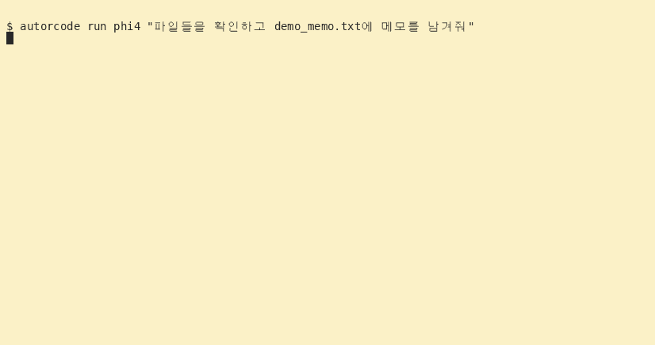

# autorcode — an LLM agent CLI that works on your own server

<p align="center">
  
  <br><b>Made by JICloud</b>
</p>

> **Local-first · your data never leaves your server.** Everything runs on Ollama by default, so neither the model weights nor session traces go to the cloud.
> Tools (web / youtube / bash / files) run inside a **sandbox + whitelist + blocklist + SSRF guard**,
> and you can explicitly switch to the cloud (model names containing `/`) via OpenRouter only when you need it. Works without a GPU.

[](https://github.com/jicine1360-prog/autorcode/actions/workflows/test.yml)

<p align="center">
  
  <br><i>autorcode demo — progress bar → tool execution (file listing) → file saving (recorded run)</i>
</p>

> ⚠️ **A learning / prototype harness — not a security boundary.**
> - bash is defended with a whitelist, blocklist patterns and RLIMIT, but a new bypass can always break through.
>   Credential access (.ssh/.aws etc.) is filtered, but that is deterrence, not a guarantee.
> - For production, put it inside container/namespace isolation (docker·firejail·seccomp) with audit logs.
> - An independent personal project, unrelated to products with a similar name (autocode etc.).

An agent that runs on local Ollama without OpenAI charges. One install gives you the `autorcode` command.
**No GPU needed** — configure only OpenRouter and the same agent runs on cloud models.

## Install
```bash
cd agent-harness && bash install.sh     # → ~/.local/bin/autorcode
```
Requirements: python3 (stdlib only). The ollama server is optional — without it, everything routes through OpenRouter.

## Usage
```bash
autorcode help                   # full cheat-sheet
autorcode doctor                 # environment diagnostics (server/models/memory)
autorcode list                   # local model list (size/load state)
autorcode run phi4 "list files"  # one-shot run — partial name (phi4) auto-matched
autorcode run phi4               # interactive REPL
autorcode chat phi4              # plain chat, no tools
autorcode run                    # no argument → uses the currently loaded model
```

## Using it without a GPU (OpenRouter)
Call the same agent via a cloud API instead of ollama — a `/` in the model name auto-routes it.
```bash
export OPENROUTER_API_KEY=sk-or-...
autorcode run deepseek/deepseek-chat-v3 "tell me the current time and date"   # one-shot
autorcode run deepseek/deepseek-chat-v3                                        # REPL
autorcode chat deepseek/deepseek-chat-v3                                       # no tools
```
- Even with ollama stopped, `OPENROUTER_API_KEY` alone lets a bare `run` auto-switch without any local model.
- The default cloud model can be changed with `OPENROUTER_MODEL` (default `deepseek/deepseek-chat-v3`).
- Any OpenAI-compatible server (vLLM etc.) can be used via `AGENT_BASE_URL`/`AGENT_API_KEY`.

## Watching it work

By default it shows the progress from the model request to the final answer.
Below is a **screen format example** (timing and content vary per run).

```text
[start] qwen3-next:80b-128k · fast · working dir: /home/hoony
[1/15] waiting for model response · qwen3-next:80b-128k
  | receiving model response · 183 chars · 6.2s
[1] model response received · 7.1s · 230 chars
[1.1 web_search · AI agent] running
  [done] 1.1 web_search · AI agent · 1.4s · 820 chars
    │ 1. Search result title
    │ https://example.com/article
[2/15] waiting for model response · qwen3-next:80b-128k
...
[done] 3 steps · 2 tool calls
```

- In a terminal, status and elapsed time refresh on a single line. When piped or logged, it
  writes one progress line every 5 seconds without ANSI control characters.
- On SSE-capable model servers it updates the received character count **while the response streams in**.
  The count is not tokens or completion ratio. Raw chain-of-thought and partial JSON are never shown.
- Tool targets, timing, result previews, failures/refusals/timeouts are all distinguished.
  Parallel results of independent lookups appear as soon as they finish; batches containing
  writes/shell/video run sequentially and never ask for approval at the same time.
- Progress goes to **stderr**, the final answer to **stdout**.

```bash
autorcode run qwen3-next:80b-128k --details  # result preview 3 lines → 12 lines
autorcode run phi4 "list files" --quiet     # final answer only, no progress
autorcode run phi4 --no-stream              # for servers without SSE support
autorcode run phi4 "list files" 2>progress.log
```

The following commands work inside a conversation without calling the model.

| command | effect |
|---|---|
| `/status` | show model, working dir, tool count, display options |
| `/tools` | list tools and arguments registered in the current process |
| `/steps on` / `/steps off` | toggle progress display |
| `/details on` / `/details off` | expand/shrink result previews |
| `/help` | conversation command help |

**A REPL left running before an update must be restarted (`exit`) afterwards.** New code and
tool lists are not reflected automatically in an already running process. The waiting indicator
does not guess whether the model is loading or inferring; before the server sends an actual
response it always shows 'waiting for model response'.

## How it works
`judgement (LLM) ↔ JSON protocol ↔ harness (tool execution / permissions / sandbox)`

- **Routing**: request keyword scoring picks fast/smart; `run <model>` pins a single model
- **Protocol**: A)single tool B)parallel tools (actions) C)done — 3-stage parser + self-repair.
  If the model answers in plain text without structured JSON, that answer is accepted as-is
  (prevents hard aborts on casual chat)
- **Tools**: bash / files (read·write·edit·list·grep) + **web_search** (DDG, no API key) /
  **web_fetch** (web pages) / **youtube** (yt-dlp meta + subtitles — "watching" videos)
- **Safety**: bash whitelist + approval gate for state-changing commands (`AGENT_PERMS=yolo|balanced|strict`),
  command blocklist patterns, path sandbox (cwd-relative), RLIMIT + process-group kill,
  SSRF guard for web tools (blocks private IP/internal services)
- **Context**: token-estimate budget trimming, `max_tokens` stops CoT blowups

## Configuration (environment variables)
```
AGENT_BASE_URL/AGENT_API_KEY   openai switch: https://api.openai.com/v1 + sk-...
AGENT_MODEL_FAST/SMART         ollama model names (default phi4:latest / qwen3.8:27b-hunmin-64k)
AGENT_PERMS                    yolo | balanced (default) | strict
AGENT_MAX_STEPS(15) AGENT_BASH_TIMEOUT(30) AGENT_CONTEXT_TOKENS(40000)
AGENT_RLIMIT_MEM_MB(4096) AGENT_RLIMIT_NPROC(128) AGENT_MAX_TOKENS(2048)
AGENT_SHOW_STEPS(1) AGENT_SHOW_DETAILS(0) AGENT_STREAM(1)   # 0/1
```
Full list: `autorcode help`

## Development / tests
```bash
python3 -m compileall -q harness agent.py
python3 -m unittest discover -s tests -v     # CI: GitHub Actions (.github/workflows/test.yml)
```

## Contact / collaboration

- **Support bot (automated)**: most questions are answered automatically by the
  management bot (FAQ + local model fallback).
- **Email**: ideas, collaboration, and deeper questions: **jicine1360@gmail.com** (reply within 24h).
- **No phone support** — all inquiries go through the support bot / email.

## Open WebUI integration

Paste `webui_tools.py` into Open WebUI (Workspace → Tools) to call autorcode tools
from the browser. The host bridge (`harness/bridge.py`) runs tools on 127.0.0.1 with
a Bearer token; the existing sandbox, RLIMIT and SSRF guards still apply.

```bash
# Run the bridge as a service (token via env or ~/autorcode/bridge.token)
AUTORCODE_BRIDGE_TOKEN=<secret> python3 -m harness.bridge --port 8787 --workspace /home/hoony
curl -X POST http://127.0.0.1:8787/tool -H "Authorization: Bearer <secret>" \
  -d '{"tool":"list_dir","args":{},"root":"/home/hoony"}'
```

- **Bridge tools**: file read/edit, web search/fetch, YouTube subtitles,
  **Excel (.xlsx) create/summary**, **PDF text extraction (pdftotext)**,
  **image OCR (tesseract)**, persistent memory (remember/recall/forget).
- **Note**: the bridge binds to localhost by default; if exposed, put it behind
  auth (authelia etc.) and rotate the token.

## License
MIT