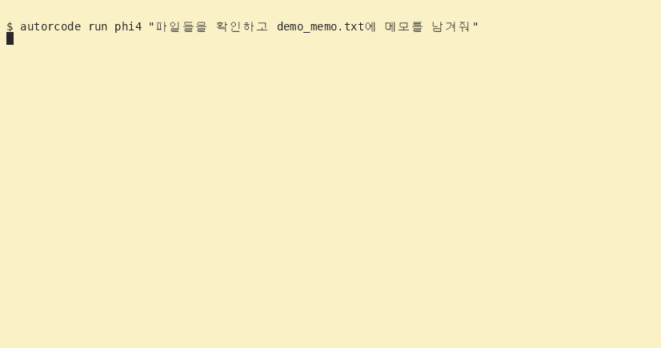

# autorcode — 내 서버가 일하는 LLM 에이전트 CLI

> 🌐 [English](README.en.md)

<p align="center">
  
  <br><b>Made by JICloud</b>
</p>

> **로컬 우선 · 데이터는 내 서버에만.** 기본으로 Ollama에서 전부 실행하므로 모델도, 잔여 기록도 클라우드로 안 나갑니다.
> 도구(웹/유튜브/bash/파일)는 **샌드박스 + 화이트리스트 + 차단패턴 + SSRF 가드**로 묶어 실행하고,
> 클라우드가 필요할 때만 OpenRouter로 명시 전환(모델명 `/` 포함)할 수 있습니다. GPU 없이도 동작.

[](https://github.com/jicine1360-prog/autorcode/actions/workflows/test.yml)

<p align="center">
  
  <br><i>autorcode 데모 — 진행 표시 → 도구 실행(파일 목록) → 파일 저장 (실제 실행 녹화)</i>
</p>

> ⚠️ **학습용/프로토타입 하네스입니다 — 보안 경계가 아닙니다.**
> - bash는 화이트리스트·차단패턴·RLIMIT으로 방어하지만, 새로운 우회 수단이 나오면 뚫린다.
>   자격증명(.ssh/.aws 등) 접근은 필터링하지만 **이건 억지력이지 보장이 아니다.**
> - 프로덕션은 컨테이너/namespace 격리(docker·firejail·seccomp)와 감사 로그 위에 얹으세요.
> - 동명의 다른 제품(autocode 등)과 무관한 개인 프로젝트입니다.

openai 과금 없이 로컬 ollama로 도는 에이전트. 설치 한 번으로 `autorcode` 명령.
**GPU가 없어도 됩니다** — OpenRouter만 설정하면 클라우드 모델로 같은 에이전트가 돌아갑니다.

## 설치
```bash
git clone https://github.com/jicine1360-prog/autorcode.git
cd autorcode
bash install.sh          # → ~/.local/bin/autorcode
autorcode help           # 동작 확인
```
- **필수**: python **3.9 이상** (표준 라이브러리만 사용 — pip 설치 불필요)
- **ollama는 선택**: 없으면 `autorcode list`에서 안내하고, OpenRouter 키만 있어도 동작
- install.sh가 자동으로: python 버전 검증 → 심링크 생성 → 실행 검증 → ollama 연결 점검
- PATH에 없으면: `source ~/.bashrc` 또는 재로그인
- 시스템 전체 설치: `sudo bash install.sh /usr/local/bin`

### 설치 후 확인 (doctor)
```bash
autorcode doctor
```
정상 출력 예시:
```text
python   : 3.12.3  /usr/bin/python3
cli 위치 : /home/younger/autorcode
ollama   : http://127.0.0.1:11434 OK — 모델 6개, 로드중 ['qwen3.8:latest']
메모리   : total 62GB / avail 48GB
경고     : AGENT_BASE_URL/OLLAMA_HOST 미설정 → autorcode run은 ollama 기본으로 동작
```
- **ollama 버전 확인/업그레이드**: `ollama --version` — 낮으면 재설치로 업그레이드:
  `curl -fsSL https://ollama.com/install.sh | sh && sudo systemctl restart ollama`
- **ollama가 꺼져 있으면**: `sudo systemctl enable --now ollama`
  (ollama 없이 쓰려면 `export OPENROUTER_API_KEY=sk-or-...` — `autorcode run`만 가능.
   키도 없으면 `run`은 즉시 안내와 함께 종료하고, 죽은 주소로 재시도하지 않는다)
- `AGENT_BASE_URL/OLLAMA_HOST 미설정` 경고는 무시해도 됨 (기본 설정 알림)
- 첫 실행:
  ```bash
  autorcode list                    # 모델 목록 확인
  autorcode run qwen3.8 "디스크 용량 봐줘"   # 바로 실행 (부분명 매칭)
  ```
- 리부팅은 불필요 — PATH 갱신(`source ~/.bashrc`)만으로 바로 사용 가능

## 사용
```bash
autorcode help                   # 전체 치트시트
autorcode doctor                 # 환경 진단 (서버/모델/메모리)
autorcode list                   # 로컬 모델 목록 (크기/로드상태)
autorcode run phi4 "파일 목록 봐" # 단발 실행 — 부분명(phi4) 자동 매칭
autorcode run phi4               # 대화형 REPL
autorcode chat phi4              # 도구 없는 단순 채팅
autorcode run                    # 인자 없음 → 로드된 모델 우선
```
**모델 고정**: `autorcode run <모델>` — 그 실행만 라우터(fast/smart)를 무시하고
지정 모델 하나로 고정합니다. 기본 fast/smart를 바꾸지 않아도 됩니다.

### 도구 호출 — 네이티브 function calling (기본)
모델이 도구를 고를 때 텍스트 JSON이 아니라 표준 `tool_calls` 프로토콜로 응답합니다.
서버(또는 프록시)가 `tools` 요청을 400/404로 거부하면 자동으로 텍스트 JSON 규식
(A/B/C)으로 재시도합니다.

- `AGENT_NATIVE_TOOLS=0` — 네이티브를 끄고 텍스트 JSON 규식으로 강제
- 작업 완료는 표준 함수 `done(answer=...)` 호출로 수신합니다
- 실행 중 **`Ctrl+C`** — 현재 단계를 버리고 즉시 `[중단]` 반환. 돌고 있던
  툴 라운드는 메모리에서 정리되므로 다음 요청이 어긋나지 않습니다
- start 전에 ollama에 설치된 모델을 확인해 없으면 `[오류]`로 알려줍니다
  (`AGENT_MODEL_FAST/SMART` 오타 방지)

### 자율 모드 (--auto)
파괴적 명령(rm -rf, pkill, curl|bash, shutdown 등)만 승인 요청하고 나머지는 자동 승인.
```bash
autorcode run --auto qwen3.8 "로그 정리 스크립트 만들어서 저장해줘"
```
(`--yes`는 전부 자동승인, `--auto`는 안전한 것만. 기본 승인모드는 AGENT_PERMS로 조정)

### MCP 도구 생태계 연결
`~/.autorcode/mcp.json`에 서버를 등록하면 남들 만든 MCP 도구를 그대로 사용한다.
```json
{ "mcpServers": { "filesystem": { "command": "npx", "args": ["-y", "@modelcontextprotocol/server-filesystem", "$HOME"] } } }
```
```bash
autorcode mcp                    # 연결된 서버/도구 목록
```
- 에이전트가 `mcp_<서버>_<도구>` 이름으로 자동 호출. ⚠️ MCP 도구는 autorcode 샌드박스를 우회하므로 신뢰하는 서버만 등록할 것.

### 텔레그램 일일 리포트
```bash
autorcode report                 # 서버 상태 → 텔레그램 전송
```
- `~/.autorcode/telegram.json` (또는 환경변수) 설정:
```json
{ "token": "123456:ABC...", "chat": "123456789" }
```
- 매일 자동 보내기: `crontab -e` → `0 9 * * * /home/유저/.local/bin/autorcode report`
- 토큰 미설정 시 stdout으로 대체 출력.

### 텔레그램 원격 승인 (TTY 없는 환경)

`agent.py` 는 TTY 가 없으면 `confirmer=None` 이고, bridge 는 항상 `False` 다.
fail-closed 라서 틀리진 않지만, systemd 로 띄운 환경에서는 승인 필요한 작업을
**하나도 못 한다**. 텔레그램 승인 게이트는 그 공백을 **포트를 열지 않고** 메운다.

`~/.autorcode/telegram.json` 에 `allowedChatIds` 를 넣으면 켜진다
(`chat` 하나만 있어도 목록 크기 1로 승격된다):

```json
{ "token": "123456:ABC...", "chat": "123456789",
  "allowedChatIds": [123456789], "approveTimeout": 180 }
```

동작 방식:
- 승인이 필요한 도구가 나오면 폰으로 `승인` / `거부` 버튼이 도착하고 **기다린다**
- 타임아웃(기본 180초)이 지나면 **거부** — 오래된 승인은 사고가 된다
- nonce 는 한 번만 쓰이고, 응답자가 허용 목록에 있어야 하며, 보낸 chat과 일치해야 한다
- 설정이 없거나 토큰 파일 권한이 느슨하면 게이트는 **애초에 열리지 않는다** (전부 거부)

`chmod 600 ~/.autorcode/telegram.json` 을 반드시 지킬 것. 리포트가 새는 것과
승인 권한이 새는 것은 다르다.

TTY 가 있는 터미널에서는 기존처럼 `y/N` 으로 묻는다 — 게이트는 TTY 없을 때만 쓴다.

> ⚠️ systemd 로 띄우는 서비스라면 주의: 예전엔 승인 필요한 작업이 **즉시 거부**됐지만
> 이제는 **폰 응답을 기다린다**. `approveTimeout` 이 서비스의 `TimeoutSec` 보다 짧아야
> 그렇지 않으면 잡이 타임아웃으로 죽는다. 게이트가 켜진 사실은 로그에 남는다.

### 폰 비서 (autorcode bot) — 텔레그램에서 명령 + 승인

폰 메시지로 작업을 시키고, 민감 작업은 폰의 `승인`/`거부` 버튼으로 결정하는
**개인 AI 비서** 모드다. getUpdates(long-polling) 하나가 승인 버튼과 명령 텍스트를
**같이** 받는다 — 여는 포트가 없다.

```
autorcode bot                 # 폴러 실행 (Ctrl+C 로 종료)
autorcode bot --token ... --chat ...   # 설정 파일 없이 직접 지정
```

명령 (`/help` 로 확인):
- 명령이 아닌 텍스트 → 전부 **작업 지시**로 실행 (로컬 ollama/모델)
- `/status` 서버 상태 요약 · `/report` 일일 리포트

작업 중 민감한 지시가 나오면 **같은 대화방**으로 `승인`/`거부` 버튼이 온다.
거부하면 실행되지 않는다. 작업은 한 번에 하나(중복 방지), 결과는 작업 후 같은 방으로.

**전용 봇을 만든다(필수).** 같은 봇 토큰은 폴러가 하나만 살 수 있다(409).
openclaw 등이 같은 토큰을 폴링 중이면(기사에 나온 그 openclaw!) 봇이 포기한다.

1. 텔레그램에서 `@BotFather` → `/newbot` → 이름/봇 계정 입력 → 토큰 발급
2. 봇에게 대화 한 번 보내고, `@userinfobot`(또는 봇의 메시지에서) 자기 chat id 확인
3. 토큰을 환경변수로 넘긴다(권장 — git/유닛 파일 어디에도 안 남는다):

```bash
cat > ~/.autorcode/bot.env <<'EOF'
AGENTUPBOT_TOKEN=999999999:AA...        # @BotFather 발급 전용 토큰
AGENTUPBOT_CHAT=123456789,234567890     # 가족 여러 명은 쉼표로 (리더 먼저)
EOF
chmod 600 ~/.autorcode/bot.env
```

   `AGENTUPBOT_CHAT` 은 단일 또는 쉼표 구분 목록을 받는다. `AGENTUPBOT_CHATS` 를
   쓰면 같은 동작. **봇과 대화를 시작한 사람만** 목록에 의미가 있다(안 한 chat 으로는
   Telegram 이 sendMessage 를 'chat not found' 로 거부한다 — 각자 봇에 첫 말부터).

   (파일 대신 `~/.autorcode/bot.json` 의 `token`/`chat`/`allowedChatIds` 로도 된다)

4. 상시 실행(사용자 systemd):

```bash
mkdir -p ~/.config/systemd/user
cat > ~/.config/systemd/user/autorcode-bot.service <<'EOF'
[Unit]
Description=autorcode 폰 비서 — 텔레그램 폴러(명령 실행 + 승인 버튼)
After=ollama.service network-online.target
Wants=network-online.target

[Service]
Type=simple
WorkingDirectory=%h
EnvironmentFile=-%h/.autorcode/bot.env
Environment=AGENT_PROVIDER=ollama
ExecStart=%h/.local/bin/autorcode bot --verbose
Restart=on-failure
RestartSec=5

[Install]
WantedBy=default.target
EOF
systemctl --user daemon-reload
systemctl --user enable --now autorcode-bot
```

없으면 `~/.autorcode/telegram.json` 을 호환으로 쓴다(리포트/구승인 게이트 공용 토큰).
작업 workspace 는 `~/autorcode-bot`(또는 `AUTORCODE_BOT_WORKSPACE`), 세션·기억과는
**폰(chat)별로 분리**된다 — 각자의 "기억해"(`~/.autorcode/memory.txt.<chat>`)와
이야기 맥락(`session_<chat>.jsonl`)이 서로 안 섞인다.

**스케줄**: "내일 9시 미팅 잡아줘" / "오늘 일정 알려줘" / "그거 지워줘" 를 자연어로
받아 폰별 일정(`<workspace>/schedule/<chat>.json`)에 저장·조회·삭제하고, 시작
**5분 전부터** 봇이 먼저 알림을 보낸다(`⏰ 일정: …`). 시간 해석/표시는 서울(KST).

## GPU 없이 사용하기 (OpenRouter)
ollama 대신 클라우드 API로 같은 에이전트 호출 — 모델명에 `/`를 넣으면 자동 라우팅됩니다.
```bash
export OPENROUTER_API_KEY=sk-or-...
autorcode run deepseek/deepseek-chat-v3 "현재 시간과 날짜 알려줘"   # 단발
autorcode run deepseek/deepseek-chat-v3                            # REPL
autorcode chat deepseek/deepseek-chat-v3                           # 도구 없이
```
- ollama가 꺼져 있어도 `OPENROUTER_API_KEY`만 있으면 모델 없이 `run`해도 자동 전환됩니다.
- 둘 다 없으면 즉시 아래 안내와 함께 종료합니다 (예전엔 죽은 127.0.0.1로 3회 재시도):
  `sudo systemctl enable --now ollama` / `export OPENROUTER_API_KEY=sk-or-...` / `AGENT_BASE_URL`
- 기본 클라우드 모델은 `OPENROUTER_MODEL`(기본 `deepseek/deepseek-chat-v3`)로 변경.
- 임의 OpenAI 호환 서버(vLLM 등)는 `AGENT_BASE_URL`/`AGENT_API_KEY`로 교체 가능.

## 실행 과정을 보면서 사용하기

기본값으로 모델 요청부터 최종 답변까지 진행 상태를 보여줍니다.
아래는 **화면 형식 예시**입니다(시간과 내용은 실행마다 달라집니다).

```text
[시작] qwen3-next:80b-128k · fast · 작업 위치: /home/hoony
[1/15] 모델 응답 대기 · qwen3-next:80b-128k
  | 모델 응답 수신 중 · 183자 · 6.2s
[1] 모델 응답 수신 완료 · 7.1s · 230자
[1.1 web_search · AI 에이전트] 실행 중
  [완료] 1.1 web_search · AI 에이전트 · 1.4s · 820자
    │ 1. 검색 결과 제목
    │ https://example.com/article
[2/15] 모델 응답 대기 · qwen3-next:80b-128k
...
[완료] 3스텝 · 도구 요청 2회
```

- 터미널에서는 한 줄에 상태와 경과 시간이 계속 갱신됩니다. 파이프/로그로 받으면
  ANSI 제어문자 없이 5초마다 진행 상태가 한 줄씩 기록됩니다.
- SSE를 지원하는 모델 서버에서는 **응답이 도착하는 동안** 수신 글자 수를 갱신합니다.
  수신량은 토큰 수나 완료율이 아닙니다. 모델의 원시 추론·미완성 JSON은 표시하지 않습니다.
- 도구별 실행 대상, 시간, 결과 미리보기, 실패/거부/시간초과를 구분합니다.
  독립 조회의 병렬 결과는 완료되는 즉시 보입니다. 쓰기·셸·영상이 포함된 묶음은
  순서대로 실행하고, 승인 질문은 동시에 띄우지 않습니다.
- 과정은 **stderr**, 최종 답변은 **stdout**입니다.

```bash
autorcode run qwen3-next:80b-128k --details  # 결과 미리보기 3줄 → 12줄
autorcode run phi4 "파일 목록 봐" --quiet  # 과정 없이 최종 답변만
autorcode run phi4 --no-stream              # SSE 미지원 서버용
autorcode run phi4 "파일 목록 봐" 2>progress.log
```

대화 중에는 모델 호출 없이 다음 명령을 사용할 수 있습니다.

| 명령 | 기능 |
|---|---|
| `/status` | 모델, 작업 위치, 도구 수, 표시 옵션 확인 |
| `/tools` | 현재 프로세스에 등록된 도구와 인자 목록 |
| `/steps on` / `/steps off` | 과정 표시 켜기/끄기 |
| `/details on` / `/details off` | 결과 미리보기 확대/축소 |
| `/help` | 대화 명령 도움말 |

**업데이트 전에 켜둔 REPL은 `exit` 후 다시 실행하세요.** 실행 중인 프로세스에
새 코드와 도구 목록이 자동 반영되지는 않습니다. 대기 표시는 모델 로딩과 추론 중 어느
단계인지 추측하지 않으며, 서버가 실제 응답을 보내기 전에는 '모델 응답 대기'로 표시합니다.

## 동작 구조
`판단(LLM) ↔ tool_calls 프로토콜(네이티브, 폴백 시 JSON) ↔ 하네스(도구 실행/권한/샌드박스)`

- **라우팅**: 요청 키워드 점수로 fast/smart, `run <model>`은 단일 모델 고정
- **프로토콜**: 기본은 네이티브 `tool_calls`(SCHEMAS에서 JSON 스키마 자동 생성,
  완료도 `done` 함수로 수신). 서버 미지원이면 A)단일도구 B)병렬도구(actions)
  C)done 텍스트 JSON으로 자동 폴백—3단 파서+셀프리페어.
  모델이 규식 JSON 없이 평문으로 답하면 그 답을 그대로 인정(캐주얼 채팅 하드중단 방지)
- **도구**: bash / 파일(read·write·edit·list·grep) + **web_search**(DDG, API키 불필요) /
  **web_fetch**(웹페이지) / **youtube**(yt-dlp 메타+자막 — 영상 "보기")
- **안전**: bash 화이트리스트 + 저술 명령 승인게이트(`AGENT_PERMS=yolo|balanced|strict`),
  명령 차단패턴, 경로 샌드박스(cwd 기준), RLIMIT+프로세스그룹 킬,
  웹 도구 SSRF 가드(사설 IP/내부 서비스 접근 거부)
- **컨텍스트**: 토큰 추정 예산 트리밍, `max_tokens`로 CoT 폭주 차단

## 설정 (환경변수)
```
AGENT_BASE_URL/AGENT_API_KEY   openai 전환: https://api.openai.com/v1 + sk-...
AGENT_MODEL_FAST/SMART         ollama 모델명 (기본 qwen3:30b-a3b / qwen3.8:latest)
AGENT_PERMS                    yolo | balanced(기본) | strict
AGENT_MAX_STEPS(15) AGENT_BASH_TIMEOUT(30) AGENT_CONTEXT_TOKENS(40000)
AGENT_RLIMIT_MEM_MB(4096) AGENT_RLIMIT_NPROC(128) AGENT_MAX_TOKENS(8192)
AGENT_REASONING_EFFORT(none)   # thinking 모델 추론 제어: none·low·medium·high (로컬 기본 none)
AGENT_SHOW_STEPS(1) AGENT_SHOW_DETAILS(0) AGENT_STREAM(1) AGENT_NATIVE_TOOLS(1)   # 0/1
```
전체 목록: `autorcode help`

## 개발/테스트
```bash
python3 -m compileall -q harness agent.py
python3 -m unittest discover -s tests -v     # 137개 · CI: GitHub Actions (.github/workflows/test.yml)
```

## 문의/협업

- **지원봇(자동 응대)**: 질문은 대부분 관리봇이 FAQ/로컬 모델로 자동 처리합니다.
- **이메일**: 제안·협업·심화 문의는 **jicine1360@gmail.com** (24시간 이내 답변).
- **전화 지원은 제공하지 않습니다** — 모든 문의는 지원봇/이메일로 처리됩니다.

## Web UI 연동 (Open WebUI)

`webui_tools.py`를 Open WebUI(작업공간 → 도구)에 붙여넣으면 브라우저에서
autorcode 도구를 호출할 수 있습니다. 호스트 브리지(`harness/bridge.py`)가
127.0.0.1 + Bearer 토큰으로 도구를 실행하며 기존 샌드박스·RLIMIT·SSRF 가드가
그대로 적용됩니다.

```bash
# 브리지를 systemd(사용자 단위)로 운영. 토큰은 유닛 파일에 두지 말고 EnvironmentFile 로 넘긴다.
# (여기에 하드코딩하면 git 히스토리에 남는다 — 실제로 한 번 유출됐다.)
umask 077 && mkdir -p ~/.autorcode
printf 'AUTORCODE_BRIDGE_TOKEN=%s\n' "$(python3 -c 'import secrets;print(secrets.token_hex(32))')" \
  > ~/.autorcode/bridge.env

# ~/.config/systemd/user/autorcode-bridge-v2.service 는
# EnvironmentFile=%h/.autorcode/bridge.env 를 읽고 127.0.0.1:8788 에 바인딩한다
systemctl --user enable --now autorcode-bridge-v2

curl -X POST http://127.0.0.1:8788/tool \
  -H "Authorization: Bearer $(sed -n 's/^AUTORCODE_BRIDGE_TOKEN=//p' ~/.autorcode/bridge.env)" \
  -d '{"tool":"list_dir","args":{"path":"."}}'
```

- **승인 게이트**: 배포된 WebUI 브리지는 `AGENT_PERMS=strict`로 운영합니다.
  `bash`/`write_file`/`edit_file` 변경은 `harness/approve.py`의 텔레그램 승인을 거칩니다.
  CLI 기본값은 `balanced`입니다.
  게이트 설정(`~/.autorcode/telegram.json`)이 없으면 **확인 필요 작업은 전부 거부**됩니다
  (fail-closed). 브리지 웹 경로도 동일한 판정을 거칩니다 — `/run` 만 거르지 않습니다.
- **8787 은 사용하지 않습니다**: 구 시스템 유닛(`autorcode-bridge.service`)은
  토큰이 git 히스토리에 남아 폐기했고, 현재 포트는 8788 입니다.

- **토큰 로딩**: `harness/bridge.py` 는 **환경변수만** 읽는다. README 에 적혀 있던
  `~/autorcode/bridge.token` 파일 로더는 구현돼 있지 않다(문서/코드 불일치).
  파일이 필요하면 systemd `EnvironmentFile=` 을 쓰면 코드 변경이 필요 없다.
- **workspace 를 홈 디렉터리로 두지 마세요**: `read_file`/`list_dir` 이 허용 목록에 있어
  `--workspace /home/ユーザー` 면 `~/.ssh`, `~/.gnupg` 가 전부 노출된다.
  작업에 필요한 하위 디렉터리 하나를 workspace 로 지정할 것.

- **브리지 도구**: 파일 조회·수정 / 웹검색·웹페이지 / 유튜브 자막 / **엑셀(.xlsx) 생성·요약** /
  **PDF 텍스트 추출(pdftotext)** / **이미지 OCR(tesseract)** / 영구 기억(remember/recall/forget) /
  **system_info (지금 실행 중인 기기의 CPU·메모리·GPU·상주 모델을 라이브로 조회)**
- **주의**: 브리지는 localhost 바인딩이 기본. 외부 노출 시 반드시
  인증(authelia 등) 뒤에 두고 토큰을 교체하세요.
- **PC 게이트(8791)**: `~/.autorcode/pcgate.token` 은 권한 `600`이어야 하며,
  그 외 권한이면 서비스가 기동을 거부합니다. 인증 비교는 constant-time이고,
  요청 본문/응답 크기, PC 슬롯·대기열·결과 수와 인증 실패 횟수를 제한하며,
  원격 IP를 기록하되 URL 토큰은 로그에서 마스킹합니다. 현재 `0.0.0.0` 바인딩은 Windows PC 접속 경로를 확인할 때까지
  유지 중입니다. 로그에서 클라이언트 경로를 확인한 뒤 Tailnet/허용 IP로 좁히세요.
  `restart`/`shutdown`/`sleep` 은 **텔레그램 사람 승인(180초)을 반드시 요구**한다 —
  토큰과 `confirm=true` 를 갖춰도 승인 거부·시간초과 시 실행되지 않고(fail-closed),
  승인 게이트를 못 만들면 아예 거부된다. `confirm=true` 는 채팅 모델이 스스로
  세팅할 수 있어 사람의 확인이 아니기 때문이다.

### Open WebUI DB 직접 수정 시 (실 사고 기록)

브리지 토큰 회전 때문에 `/app/backend/data/webui.db` 의 `tool.valves` 를 직접 UPDATE 했다.
`updated_at` 을 문자열로 써 넣었고, 이 열은 epoch **정수**라 다음 채팅에서 도구 등록이
통째로 실패했다:

```
ValidationError: 1 validation error for ToolModel
updated_at — Input should be a valid integer [type=int_parsing]
```

토큰 변경은 성공했는데 위 에러를 보고도 넘어갔다. **쓰기가 성공했다는 사실과 읽기가
성공한다는 사실은 다르다.**

앞으로 DB 를 만질 때는:

1. **컬럼 타입 먼저 확인** — `open_webui/models/tools.py` 의 `ToolModel` 정의를 읽을 것.
   `updated_at`/`created_at` 은 둘 다 `int` (epoch).
2. **변경 전 백업** — `cp webui.db webui.db.bak-$(date +%Y%m%d-%H%M%S)`
3. **변경 후 ORM 경로로 재검증** — 원시 `sqlite3` 으로는 확인이 안 된다. `specs` 는
   `Column(JSONField)` 라 ORM 이 파싱하고, 원시 조회로는 타입 str 로 보인다(정상).
   아래처럼 실제 로드 경로를 타야 한다:

   ```bash
   docker exec open-webui sh -c 'cd /app/backend && python3 -c "
   import sys,asyncio; sys.path.insert(0,\"/app/backend\")
   from open_webui.models.tools import Tools, ToolModel
   from open_webui.internal.db import AsyncSessionLocal
   async def m():
       async with AsyncSessionLocal() as db:
           print(ToolModel.model_validate(await Tools.get_tool_by_id(\"autorcode\", db)).name)
   asyncio.run(m())"'
   ```

- 지원 문의는 위 "문의/협업" 항목(이메일)을 사용합니다.

## License
MIT
